# Hack-O-Week - 5th Semester Projects (Weeks 1-14)

| | |
|---|---|
| **Name** | Parth Denge |
| **PRN** | 240705201018 |
| **Program** | Symbiosis - Semester 5 |

A single repository covering all 14 weeks of the Hack-O-Week plan: two web apps, then Python, maths for ML,
supervised and unsupervised learning, dimensionality reduction and ensemble methods. Every Python week has its own
demo (which prints its results and saves a plot) and a `unittest` suite.

## Repository layout

```
week1_library_management/            Library Management System (HTML, CSS, JavaScript)
week2_whiteboard/                    Canvas whiteboard (pen, shapes, eraser, undo/redo, save PNG)
week3_python_essentials/             OOP, dunder methods, comprehensions, generators
week4_numpy_pandas_dataviz/          NumPy vectorisation, Pandas pipeline, Seaborn/Matplotlib
week5_linear_algebra/                Vectors, projections, Gram-Schmidt, eigenvalues, PCA
week6_calculus_gradients/            Derivatives, autograd engine, GD / Momentum / Adam
week7_regression/                    Normal equation, GD, polynomial, Ridge, Lasso
week8_classification/                Logistic regression, KNN, confusion matrix, ROC-AUC
week9_sklearn_workflow/              ColumnTransformer, Pipeline, GridSearchCV, interpretation
week10_clustering/                   K-Means++, hierarchical, DBSCAN
week11_12_dimensionality_reduction/  PCA and t-SNE: intuition and applications
week13_14_ensembles_bias_variance/   Bagging, Boosting, XGBoost, LightGBM, bias-variance, L1/L2
output_screenshots/                  Screenshots and console output for every week
common.py                            Shared helpers (plot saving, author stamp)
run_all_tests.py                     Runs every test suite
run_all_outputs.py                   Runs every demo and regenerates output_screenshots/
```

## Setup and usage

```powershell
python -m pip install -r requirements.txt

python run_all_tests.py          # 10 suites, 48 tests
python run_all_outputs.py        # regenerates every plot + console_output.txt

# Weeks 1 and 2 are static sites - serve the folder and open it in a browser
python -m http.server 8000
#   http://localhost:8000/week1_library_management/
#   http://localhost:8000/week2_whiteboard/
```

---

## Output and what each week shows

Full console output is in [`output_screenshots/console_output.txt`](output_screenshots/console_output.txt).

### Week 1 - Library Management System
Add, search, filter, issue/return and delete books. Data persists in `localStorage`.

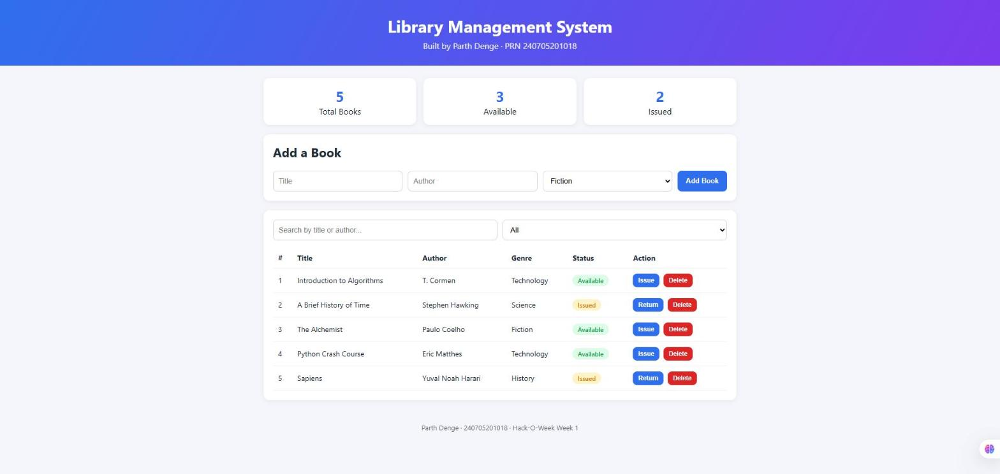

### Week 2 - Canvas Whiteboard
Freehand pen, line / rectangle / circle tools, eraser, colour and size controls, undo/redo (Ctrl+Z / Ctrl+Y)
and PNG export. Shapes are stored as objects and redrawn, which is what makes undo/redo possible.

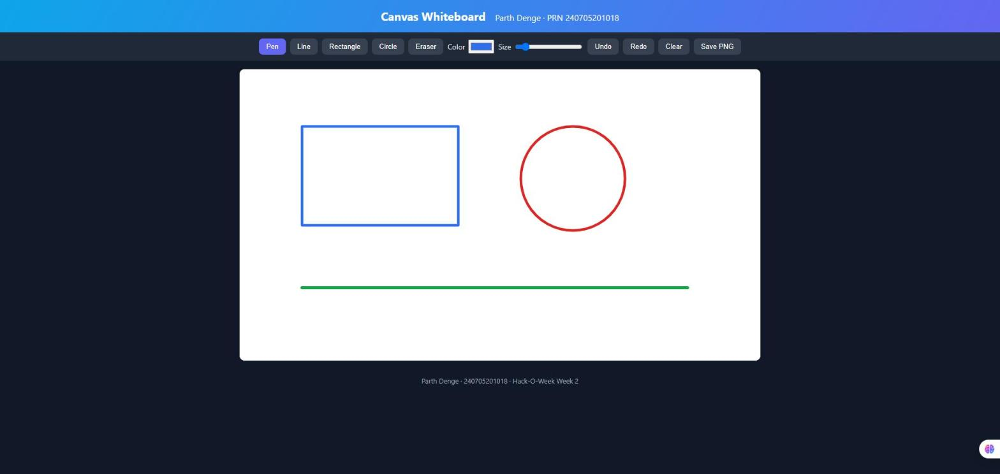

### Week 3 - Python Essentials
Inventory model with inheritance (`PerishableItem` discounts near-expiry stock), `__len__` / `__iter__` /
`__getitem__` / `__contains__`, a frozen dataclass, comprehensions and streaming generators.
Console output: total inventory value `2800.0`, Fibonacci generator, chunked reading, running average.

### Week 4 - NumPy, Pandas and Data Visualisation
Broadcast-based pairwise distance matrix, z-scoring, group-wise median imputation, revenue aggregation, and a
four-panel dashboard.

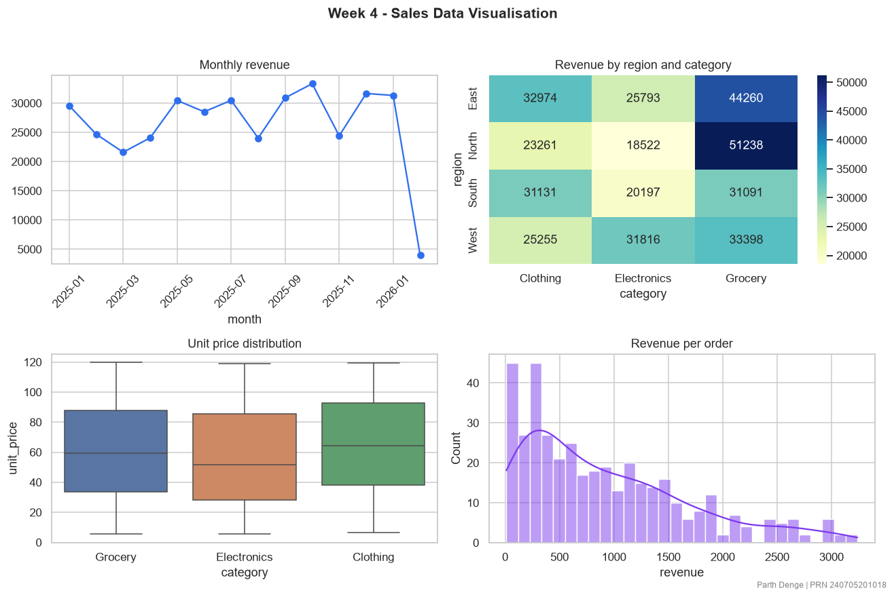

### Week 5 - Linear Algebra
Dot product, cosine similarity, projection, Gram-Schmidt (Q Q^T = I verified), power iteration
(dominant eigenvalue 3.61803, matching NumPy) and PCA principal axes.

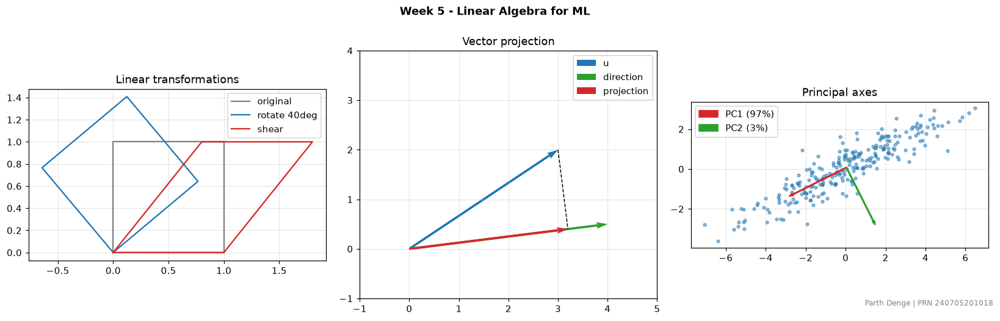

### Week 6 - Calculus and Gradients
Numerical vs analytic derivative, a reverse-mode autograd `Value` class checked against finite differences, and
Gradient Descent / Momentum / Adam on an ill-conditioned bowl.

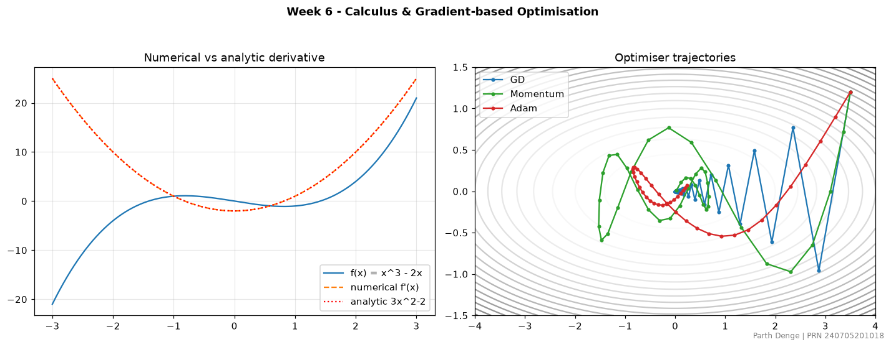

### Week 7 - Regression from Scratch
The normal equation and gradient descent reach identical weights (`[-2.969, 4.4542]`). Degree 1 / 3 / 12
polynomials show under- and over-fitting; Ridge shrinks coefficients, Lasso drives them to exactly zero.

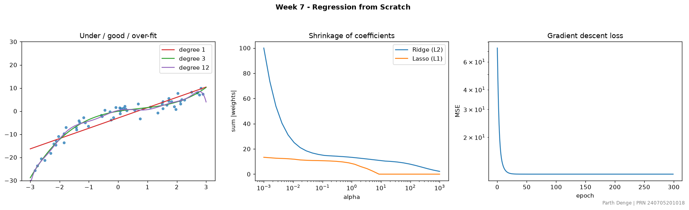

### Week 8 - Classification from Scratch
One-vs-rest logistic regression and KNN (both 95.6% on the 3-class blobs), confusion matrix, precision / recall /
F1, and ROC-AUC (0.999 for class 1 vs rest).

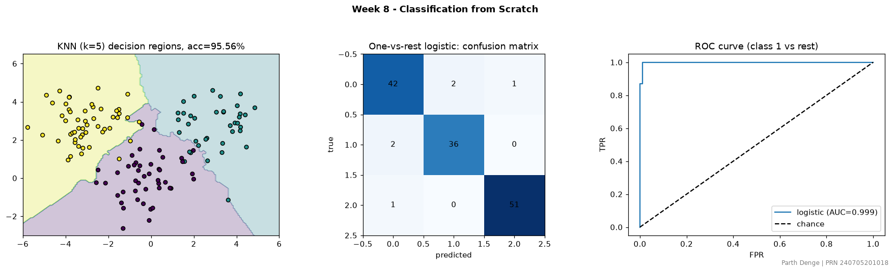

### Week 9 - scikit-learn Workflow
Churn prediction with a `ColumnTransformer` (imputation, scaling, one-hot) inside a `Pipeline`, tuned with
`GridSearchCV`. Logistic regression (test AUC 0.8045) edged out Random Forest (0.7904). Permutation importance
is used for interpretation.

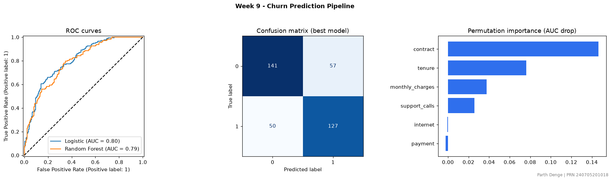

### Week 10 - Clustering
K-Means++ written from scratch (with restarts), Ward hierarchical clustering and DBSCAN. K-Means and Ward both
recover the blobs (ARI 0.961); on the two-moons data K-Means fails (ARI 0.27) while DBSCAN gets it exactly (1.0).

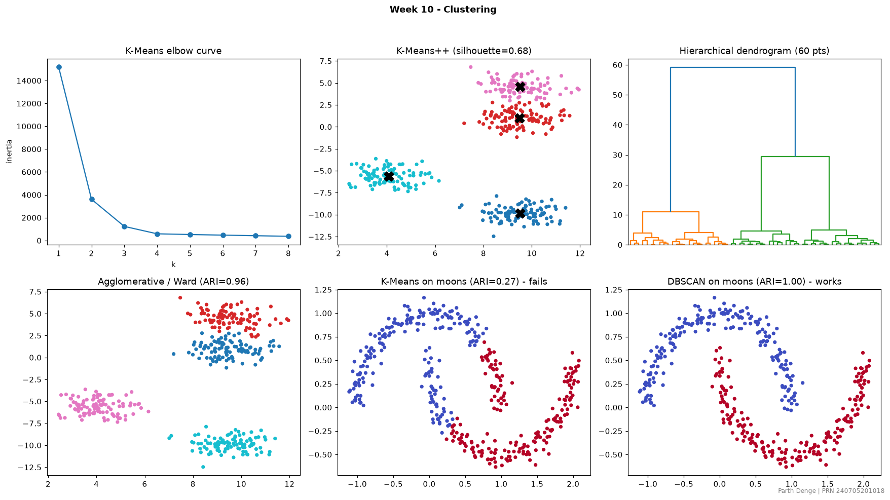

### Weeks 11 and 12 - Dimensionality Reduction (PCA and t-SNE)
The 64-dimensional Digits data is reduced to 2-D. PCA is linear and shows overlapping classes; t-SNE separates the
digits into clean clusters because it preserves local neighbourhoods. PCA written from scratch with SVD matches
scikit-learn's explained variance, 29 of 64 components keep 95% of the variance, and 20 components are enough to
retain ~90% classification accuracy. The last panel shows how perplexity changes the t-SNE layout.

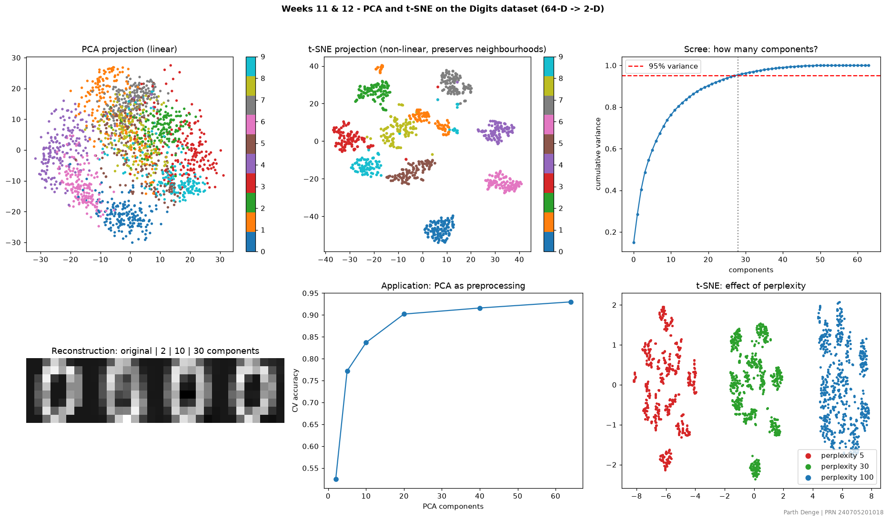

### Weeks 13 and 14 - Ensembles, Bias-Variance and Regularisation
- **Bagging vs boosting:** a single tree overfits (train 1.00, test 0.79); Bagging, Random Forest, XGBoost and
  LightGBM all generalise better (test up to 0.905 for LightGBM).
- **Under/over-fitting:** the depth sweep shows test accuracy peaking at a moderate depth and falling as the tree
  memorises the training set.
- **Bias-variance:** shallow trees have high bias and low variance; deep trees the reverse.
- **Regularisation:** with strong L1 (small C) only 1 of 20 coefficients stays non-zero, whereas L2 keeps all 20
  and only shrinks them.

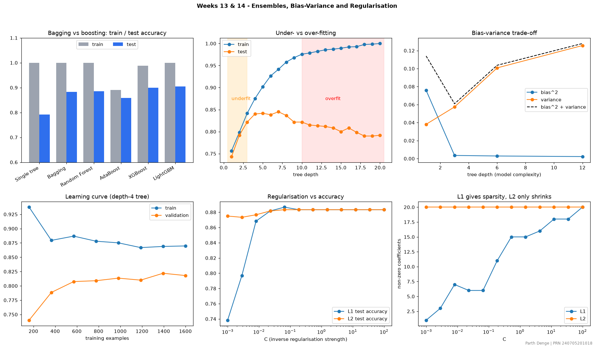

---

Parth Denge | PRN 240705201018
